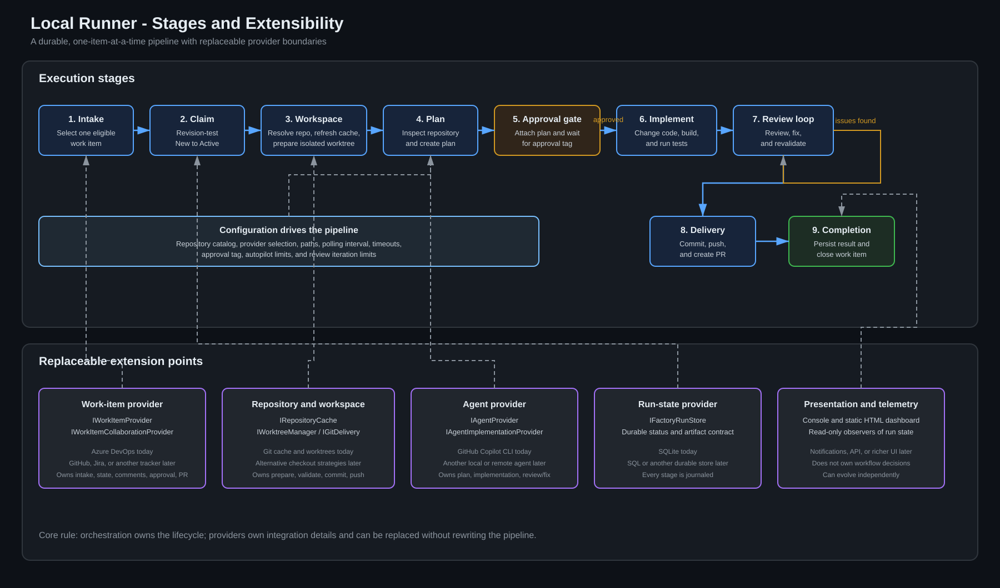

# Local Runner Stages and Extensibility

The local runner owns the workflow from intake through completion. Integration details sit behind provider contracts so work-item systems, source-control mechanics, coding agents, durable storage, and presentation can evolve independently.

The editable Mermaid source is [architecture-diagram.mmd](architecture-diagram.mmd). The SVG is generated and stored locally, so viewing the diagram does not require an external rendering service.

## Execution stages

| Stage | Responsibility |
|---|---|
| 1. Intake | Select one eligible work item and resolve its configured repository |
| 2. Claim | Atomically move the work item from `New` to `Active` using its ADO revision |
| 3. Workspace | Refresh the repository cache and create or safely reuse an isolated task worktree |
| 4. Plan | Ask the configured agent to inspect the repository and produce a Markdown implementation plan |
| 5. Approval gate | Attach the plan, request human review, and poll for `AgentFactoryPlanApproved` |
| 6. Implement | Verify the worktree, then ask the agent to change code, build, and run relevant tests |
| 7. Review loop | Review the complete diff, fix issues, and repeat validation until approved or the configured limit is reached |
| 8. Delivery | Commit and push the task branch, then create an Azure Repos pull request |
| 9. Completion | Persist delivery metadata and revision-test the work-item transition to `Closed` |

Every stage is journaled. The runner handles one item at a time, resumes approval waits after restart, and blocks new intake when another active run requires diagnosis.

## Extension points

### Work-item provider

`IWorkItemProvider` covers query and state transitions. `IWorkItemCollaborationProvider` adds refresh, attachment, comment, approval, and pull-request collaboration.

The current adapter uses Azure DevOps. A GitHub, Jira, or other tracker adapter can replace it without changing the stage orchestration.

### Repository and workspace providers

`IRepositoryCache`, `IWorktreeManager`, and `IGitDelivery` isolate repository preparation and delivery mechanics.

The current adapters use Git caches, Git worktrees, Git Credential Manager, commit, and push. Alternative checkout or delivery strategies can implement the same contracts.

### Agent provider

`IAgentProvider` creates plans. `IAgentImplementationProvider` performs implementation and review/fix iterations.

The current adapter uses GitHub Copilot CLI in plan and autopilot modes. Another local or remote coding agent can replace it while preserving the approval and delivery stages.

### Run-state provider

`IFactoryRunStore` persists lifecycle state, plans, attachment URLs, commit IDs, and pull-request metadata.

The current implementation uses SQLite beside the executable. A centralized SQL or other durable store can replace it for multi-runner scenarios.

### Presentation and telemetry

Console output and the static HTML dashboard observe the durable run state; they do not own workflow decisions.

Notifications, an API, richer dashboards, or monitoring integrations can be added without changing the core pipeline.

## Extensibility rule

The orchestration layer owns **what stage comes next**. Providers own **how an external capability is performed**. Provider-specific types stay outside the domain and application workflow.
