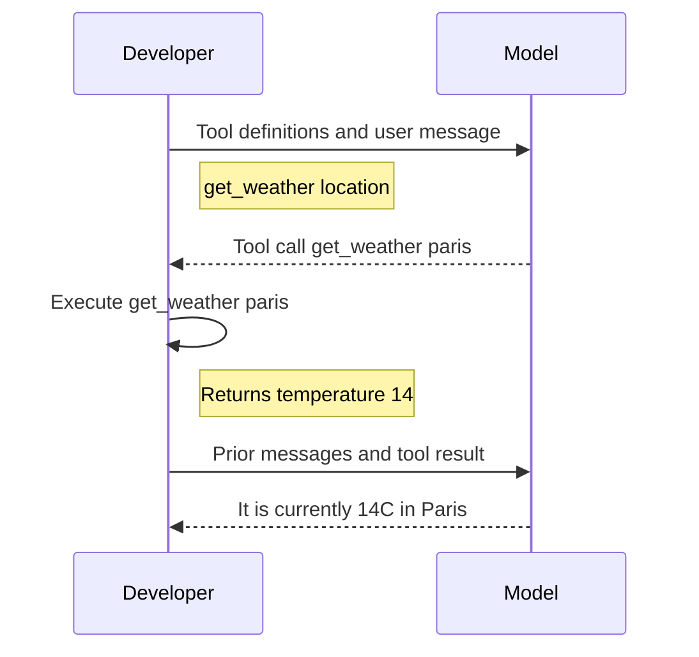

# Tool Calling Flow

## Overview

The tool calling flow describes how developer code and an LLM model interact to execute function calls and return results to the user.

1. **The code tells LLM what tools they can call**
2. **The LLM responds with suggested tool name and arguments**
3. **The code calls function for that tool**
4. **The code sends prior messages and return value from tool function to LLM**
5. **The LLM responds based off full history**

## Sequence Diagram

## Reference

- [OpenAI Function Calling Guide](https://platform.openai.com/docs/guides/function-calling)
